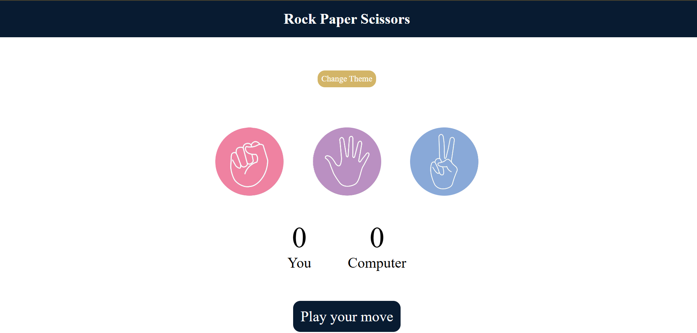
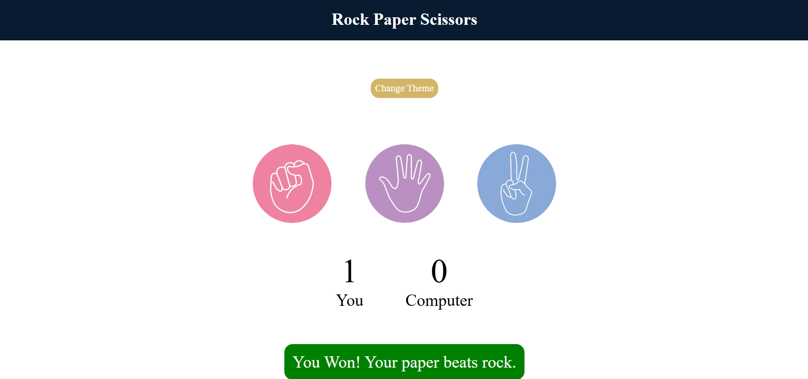

Rock Paper Scissors Game

A fun and interactive Rock Paper Scissors game developed using HTML, CSS, and JavaScript. Play against the computer with instant results, score tracking, and a responsive user interface.

Live Demo 

https://kangnagupta1225.github.io/Rock-Paper-Scissors-game/


Screenshot






Features

-  Play against the computer
-  Random computer choices
-  Live score tracking
-  Win/Lose/Draw result display
-  Fully responsive design
-  Smooth and clean UI

Technologies Used

- HTML5
- CSS3
- JavaScript (ES6)

Project Structure

```
Rock-Paper-Scissors/
│
├── index.html
├── style.css
├── index.js
├── images/
│   └── screenshot.png
│   └── screenshot1.png
└── README.md
```

How to Run

1. Clone the repository
2. Open `index.html` in your browser

Future Improvements

- Add sound effects
- Dark mode
- Difficulty levels
- Match history
- Better animations

Author

Kangna Gupta

⭐ If you enjoyed this project, consider giving it a star!